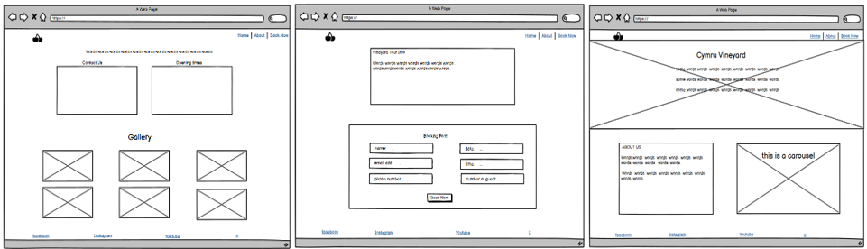
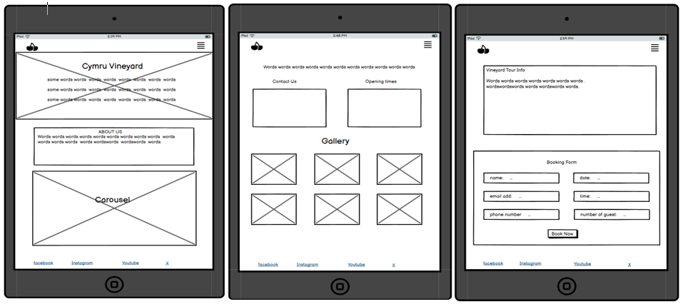
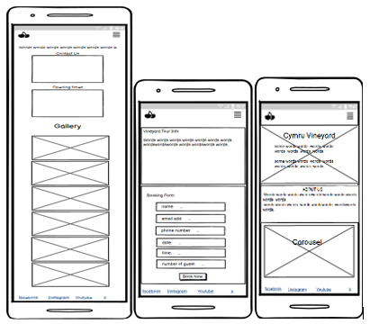
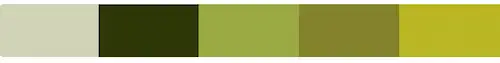

# CYMRU VINEYARD

Cymru vineyard website will provide a clear and comprehensive resource for those interested in exploring vineyards tours or travellers. It offers detailed information about the tour experience, including pricing, what's included, and our operating days and times, ensuring everything is easily accessible for those planning a visit. With a focus on creating a relaxing experience for adults, couples, and group of friends, the site highlights the serene charm of the vineyard nestled in a peaceful valley. The goal is to highlight the tranquil and inviting nature of the tours, helping visitors understand what they can expect and make informed decisions about their day out.

## UX

This website involves structuring the information in a way that is visually appealing and easy to navigate.

The homepage layout will include a welcome section with a captivating image of the vineyard, brief history of the vineyard with a few carousel images, and the navigation bar with straightforward labels such as home, about, and book now.

The about page will contain the contact information, operational days and times, and a gallery section.

A straightforward booking page was created separately for the user to input their information such as name, date, etc. while all the information about the tour is being displayed in one page.

## WIREFRAME

These wireframs screenshots illustrate the responsive dedsign, showcasing the desktop, tablet, and mobile layouts. 

* Desktop

* Tablet

* Mobile

## Colour Scheme

The colour scheme for the design draws inspiration from a vineyard image, providing a harmonious and visually appealing palette: 

* Primary colour #2E3708 - Blind Forest: Main colour for text, navbar and footer background colour, giving a sense of calmness and sophistication to the design.

* Secondary colour #FFFFFF - White: white colour to contrast dark colour background ensuring content remains readable and uncluttered.

* Highlight Colour #BAB723 - Pickled Limes: used to focus to important elements like buttons or call to action.

* Background Colour #9BAA43 - Ogryn Camo: to highlight the booking form.

This palette was carefully chosen using [Image Color Picker](https://imagecolorpicker.com/).