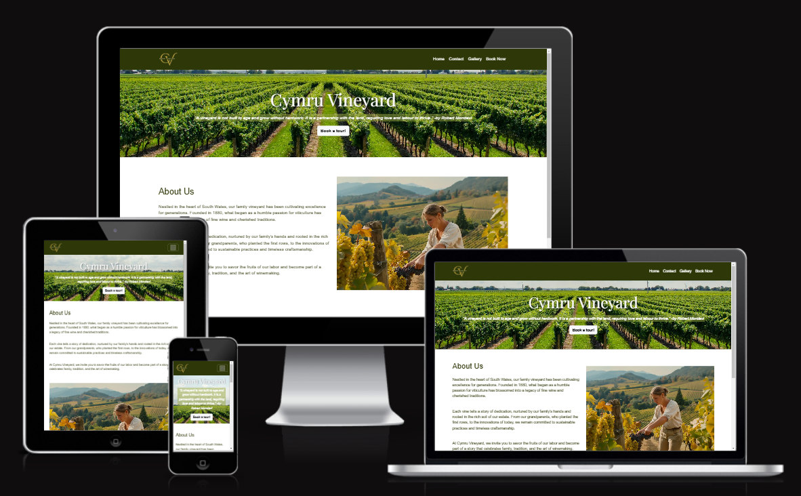
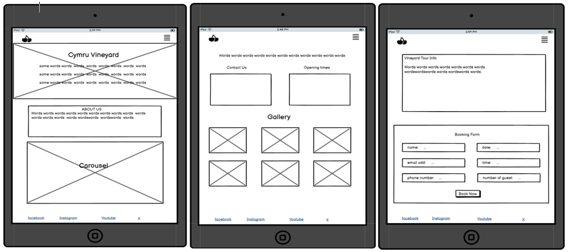

# CYMRU VINEYARD

Cymru vineyard website will provide a clear and comprehensive resource for those interested in exploring vineyards tours. It offers detailed information about the tour experience, including pricing, what's included, and our operating days and times, ensuring everything is easily accessible for those planning a visit. With a focus on creating a relaxing experience for adults, couples, and group of friends, the site highlights the serene charm of the vineyard nestled in a peaceful valley. The goal is to highlight the tranquil and inviting nature of the tours, helping visitors understand what they can expect and make informed decisions about their day out.

# UX
---

### Homepage 

 Welcome Section: A full-width hero image showcasing the vineyard during a scenic time of the day. A quote message from Robert Mondavi about vineyard. And a call-to-action button "Book a tour".
- About Us Section: Includes a brief history of the vineyard family business and a carousel of images showing the owner's photo in the vineyard and grapes that is produced in the vineyard.
- Navigation Bar: Home, Contact, Gallery, Book Now.
- Contact Information: an easy to find address, email address and phone number. 
- Operational Days and Times: displayed using table to show a clear scheduling pattern.

### Gallery Page

* Gallery Section: A currated gallery showcasing happy visitors and images of the vineyard. 

### Booking Page

- Tour Information: Pricing and tour inclusion.
- A user-friendly form: input fields for name, contact information, preferred date, time and number of people.
- A clear call-to-action: "Secure booking"

### Additional Pages
* Booking Confirmation Page: Confirms successful booking submissions with a message and includes a link to return to the homepage.

* 404 Page: Displays an error message for non-existent pages and provide links to the homepage and other sections for easy navigation.

## User Stories

### First-Time Visitors
- I want to learn about the vineyard and the available tours to decide if I want to book a visit.
- I need clear information about tour prices and what is included.
- I am looking for an easy-to-use booking form to reserve my spot.

### Returning Customer
- I want to know about discounts or special offers so that I feel appreciated.
- I want to quickly book another tour without hassle.

### General Users
- I want the website to be visually appealing and responsive so that it works well on any device.
- I want clear navigation to find the information I need without confusion.
- I want easy access to the vineyard's contact details and social media links.

These stories help ensure the website meets the needs of its target audience effectively.

### Upcoming Features

* Shopping: list of the wines produced in this vineyard, new or existing customer can buy wine online.

* Vineyard Restaurant: visitor can also book brunch or tea before or after the tour.

### WIREFRAME

These wireframes screenshots illustrate the responsive design, showcasing the desktop, tablet, and mobile layouts. 

* Desktop

* Tablet

* Mobile

## Font

Google Font library was used for this site.

* ["Playfair Display"](https://fonts.google.com/specimen/Playfair+Display) - used as a primary font for headings and titles.
* ["Great Vibes"](https://fonts.google.com/specimen/Great+Vibes) - used as a secondary font for all body text element.  

## Icon

[Font Awesome](https://fontawesome.com/) library was used for the icons found in the footer.

* such as icon for Facebook, Instagram, Youtube and X.

[favicon](https://favicon.io/) 

* favicon was generated using [favicon](https://favicon.io/). 

### Colour Scheme

The colour scheme for the design draws inspiration from a vineyard image, providing a harmonious and visually appealing palette: 

* Primary colour #2E3708 - Blind Forest: Main colour for text, navbar and footer background colour, giving a sense of calmness and sophistication to the design.

* Secondary colour #FFFFFF - White: white colour to contrast dark colour background ensuring content remains readable and uncluttered.

* Highlight Colour #BAB723 - Pickled Limes: used to focus to important elements like buttons or call to action.

* Background Colour #9BAA43 - Ogryn Camo: to highlight the booking form.

This palette was carefully chosen using [Image Color Picker](https://imagecolorpicker.com/).

## Technologies Used
---

* [HTML](https://en.wikipedia.org/wiki/HTML): Utilised for structuring the main site content.

* [CSS](https://en.wikipedia.org/wiki/CSS): Applied for styling the website.

* [Bootstrap](https://getbootstrap.com/): Used for creating a responsive and visually appealing design with prebuilt components and grid layouts.

* [GitHub](https://github.com/): Used for secure online code storage and pages deployment of the website.

* [Gitpod](https://www.gitpod.io/): a cloud-based IDE for convenient and consistent development. CI student account was used in this project.

## Testing
---

All testing conducted for this project has been documented in separate file [TESTING.md](TESTING.md). This includes:

* Validation: code checked for HTML and CSS using W3C validator and Jigsaw.

* Lighthouse Testing: google lighthouse was used to test the site's Performance, Accessibility, and Best Practices.

* Responsiveness: ensuring the site function seamlessly across various devices using tools such as Chrome DevTools.

* Browser Compatibility: Validating compatibility on popular browsers, cluding Chrome, Firefox, Opera and Edge.

* Bugs

## Deployment
---

This concise guide covers the essential steps for deployment.

Steps to deploy a project on Github pages:

1. Navigate to your Github repository.
2. Click on the **Settings** tab at the top of the reposiroty page.
3. In the left-hand menu, select **Pages** under the Code and Automation.
4. Under the Source section, choose the branch you want to deploy which is **main**, and select the folder **/root** for deployment.
5. Click **Save**.
6. After a few moments, **Github Pages** will provide a live URL where your site is hosted.

Steps to Create a Github Account
1. Go to GitHub: visit [github.com](https://github.com/) and click Sign up in the top right corner.
2. Enter Details: provide email and password.
3. Verify Account: complete the captcha to verify you're human.
4. Choose a plan: select the free plan.
5. Verify Email: check your email and click the verification link.
6. Set up Profile: this is optional. Add you name, photo, etc.
7. Start using Github

Steps to Run the Project in Gitpod
1. Open Github Repository: go to your repository page.
2. Launch Gitpod
3. If prompted, sign in to Gitpod.
4. Wait for environment setup.
5. Run the project: once the workspace is ready, follow the instructions in the terminal, "python3 -m http.server" to launch the project.
6. Open the browser preview in Gitpod to view and interact with the project. 

## Credits

### Content and Inspiration

* Code Institute Lessons: Provided foundation knowledge and concepts, including best practices for structuring HTML, Bootstrap and CSS in a project.

* This project was inspired by my visit to a vineyard in San Gimignano, Italy last year. The expirenced left a lasting impression on me, combining the beauty of the lanscape with the art of winemaking. 

### Media and Tools

* [Google Font](https://fonts.google.com/) used for all typography and text styling on the site.

* [Font Awesome](https://fontawesome.com/) used for all icons featured on the site.

* [Bootstrap](https://getbootstrap.com/) provided prebuilt code for layout, components and reponsive design.

* [Favicon](https://favicon.io/) used to create the favicon displayed on the browser tab.

* [freepik.com](https://www.freepik.com/) and [unsplash.com](https://unsplash.com/) sourced high-quality images used throughout the site.

* [squoosh.app](https://squoosh.app/) utilised for compressing and optimising images for better performance.

* [canva](https://www.canva.com/?msockid=1642eb6570d860442d60f9db71976156) used for designing the logo, and MS Photos App was used to create a transparent background for the logo.

* MS Snipping tool was used to capture and save screenshots or print screen images for documentation purposes.  

* [image colour picker](https://imagecolorpicker.com/) assisted in generating the colour palette for the site's design.

* [Markdown cheatsheet](https://github.com/adam-p/markdown-here/wiki/Markdown-Cheatsheet#images) by Adam Pritchard: A reference for writing README.md and TESTING.md files, supplemented by guidance from Code Intitute.

* [Grammarly](https://www.grammarly.com/) this documentation has been grammar-proofed using Grammarly to ensure clarity and professionalism.

* [ui.dev](https://ui.dev/amiresponsive) used to show website appearance on desktop, laptop, tablet, and phone.

### Code

* Markdown Cheatsheet provided by Adam Pritchard, Code Institute.

* The majority of the codebase for this website is built using [Bootstrap](https://getbootstrap.com/). Bootstrap's prebuilt components and responsive grid system were utilised to create a modern and user-friendly design with minimal custom coding.

* Footer placement: The idea for keeping the footer fixed at the bottom of the page, regardless of contetnt length, was inspired by a Code Institute lesson. The solution was implemented using Bootstrap's utility classes.

* Navbar positioning: Similarly, the technique to align the navigation bar at the top right of the page was inspired by Code Institute. This adjustment also leveraged Bootstrap's features.

* Fixed Navbar: The concept of keeping the navbar fixed at the top of the page, ensuring it stays visible while scrolling, was also inspired by a Code Institute lesson. This functionality was implemented using Bootstrap's fixed-top class together with custom CSS adjustments for styling.

By combining Bootstrap's built-in functionality with insights from Code Institute lessons, the site achieves a seamless blend of professional design and tailored adjustments.
 

### Acknowledgements

I would like to express my heartfelt gratitude to the following individuals and team for their support and guidance throughout this project:

* To my mentor Rory Patrick Sheridan for providing invaluable guidance, crucial tips, and constructive suggestions that greatly enhanced this project.

* To my cohort facilitator Lewis Dillon for consistently addressing my questions and offering timely advice on the course, project development, and more.

* To the Code Institute Tutor team for their support and assistance, espicially in resolving challenges related to Github and Gitpod.

### Notes on Commit History
The commit history for this project may appear messy as I am still getting used to managing and refining commits effectively. I plan to improve my workflow and adopt better practices for commit organisation in the future projects.