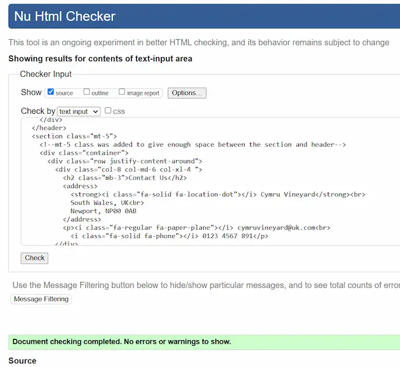

# TESTING

## Code Validation

To validate all HTML files, the recommended validator website by Code Institute which is [HTML W3C](https://validator.w3.org/) was used.

| Validator | Page | Comment | Screenshot |
| --- | --- | --- | --- |
| [W3C](https://validator.w3.org/) | Home | No Errors |  