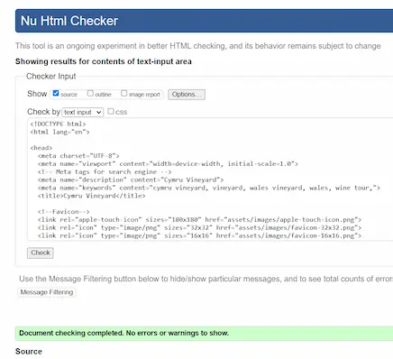
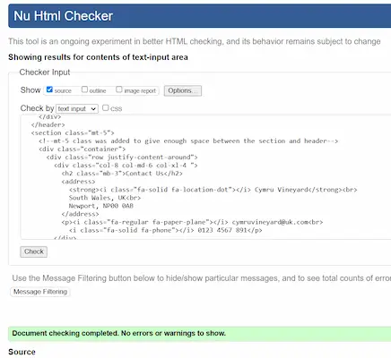
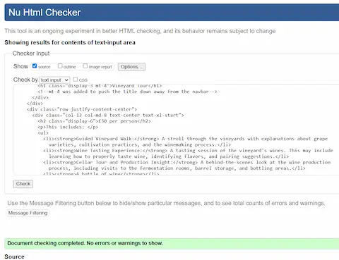
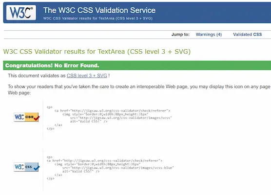

# TESTING

## Code Validation

To validate all HTML files, the recommended validator service by Code Institute which is [HTML W3C](https://validator.w3.org/) was used.

| Validator | Page | Comment | Screenshot |
| --- | --- | --- | --- |
| [W3C](https://validator.w3.org/) | Home | No Errors |  |
| [W3C](https://validator.w3.org/) | About | No Errors |  |
| [W3C](https://validator.w3.org/) | Book Now | No Errors |  |

To validate the CSS file, the recommended validator service by Code Institute which is [Jigsaw W3C](https://jigsaw.w3.org/css-validator/) was used.

| Validator | Page | Comment | Screenshot |
| --- | --- | --- | --- |
| [Jigsaw W3C](https://jigsaw.w3.org/css-validator/) | style.css | No Errors |  |