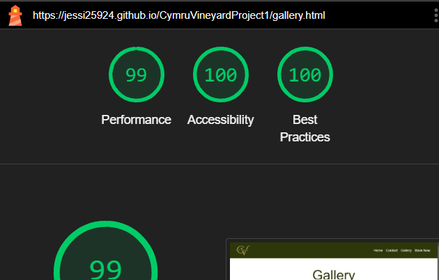

# TESTING

## Code Validation

To validate all HTML files, the recommended validator service by Code Institute which is [HTML W3C](https://validator.w3.org/) was used.

| Validator | Page | Comment | Screenshot |
| --- | --- | --- | --- |
| [W3C](https://validator.w3.org/) | Home | No Errors |  |
| [W3C](https://validator.w3.org/) | Gallery | No Errors |  |
| [W3C](https://validator.w3.org/) | Book Now | No Errors |  |
| [W3C](https://validator.w3.org/) | Booking Confirmation | No Errors |  |
| [W3C](https://validator.w3.org/) | 404 | No Errors |  |

---

To validate the CSS file, the recommended validator service by Code Institute which is [Jigsaw W3C](https://jigsaw.w3.org/css-validator/) was used.

| Validator | Page | Comment | Screenshot |
| --- | --- | --- | --- |
| [Jigsaw W3C](https://jigsaw.w3.org/css-validator/) | style.css | No Errors |  |
---

## Lighthouse Testing

Lighthouse was used to evaluate the website's performance, accessibility and best practices. This testing ensures the site meets modern web standards and provides an optimised user experience accross devices.

| Device | Page | Comment | Screenshot |
| --- | --- | --- | --- |
| Desktop | Home | minor warning |  |
| Mobile | Home | Some warnings cannot be resolved as they involve external libraries. |  |
| Desktop | Gallery | Some warnings cannot be resolved as they involve external libraries. |  |
| Mobile | Gallery | Some warnings cannot be resolved as they involve external libraries. |  |
| Desktop | Book now | minor warnings |  |
| Mobile | Book now | minor warnings |  |
---

## Responsiveness

I tested the layout's adaptability to various screen sizes and orientation, ensuring that the users enjoy a consistent and optimised experience, whether they're browsing on mobile, tablet or laltop/desktop. This ensure that all elements, such as images, text and navigation, adapt correctly and maintain usability regardless of the device.

| Device | Comment | Screenshot |
| --- | --- | --- |
| Mobile (Chrome DevTools) | Achieves desired functionality |  |
| Tablet (Chrome DevTools) | Achieves desired functionality |  |
| Laptop 1024px (Chrome DevTools) | Achieves desired functionality |  |
| Laptop 1440px (Chrome DevTools) | Achieves desired functionality |  |
---

## Browser Compatibility

I have tested the site across major browsers including Chrome, Firefox, MS Edge, Opera, and Safari. Each browser renders the site as intended, ensuring a consistent and seamless user experience.

* **Chrome**

* **Firefox**

* **MS Edge**

* **Opera**

* **Safari**

---

## bugs

* The header text has visibility issue when the site is viewed on screens 1440px or wider.

**_to resolved this, I restyled the header text using CSS, changing the color to white with text-shadows._**

* There is a margin issue with the booking form when viewed on screens 1024px or smaller; the gap is not sufficient.

**_to resolved this, I customised it using CSS, setting the margin-top to 40px and margin-bottom to 80px._**

* There is an insufficient gap between the "Contact Us" and "Opening Times" sections when viewed on screens 425px or smaller.

**_To resolved this, I added Bootstrap utility class mb-5 directly in HTML._**

* Toggler icon is not visible on screens 768px or smaller due to the darker navbar background colour.

**_To resolved this, I customised the toggler icon using CSS, setting the toggler to have lighter border-color and backround-color._**

* The book Now button changes position when the site is viewed on screens 1440px or wider.

I tried to customised it using CSS, setting the button to display: block and margin-top: 15px.However, it did not resolved the issue.

**_Then, I separate the button into it's own div so, it became a standalone block element._**

* Carousel positiong issue: when viewed on screen of 1024px, the margins are sufficient. However, when viewed on screens smaller than 1024px and wider than 1024px, the carousel does not have enough gap.

**_to resolved this, I added Bootstrap utility classes mt-4 and mb-4 directly in HTML._**